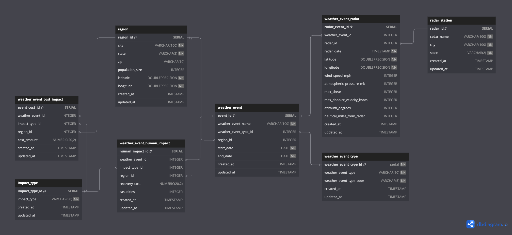

<h1>Weather Wizards: Storm Data ETL and Visualization</h1>

<h2>1. Project Overview</h2>

This project provides an end-to-end solution for loading, transforming, and analyzing weather-related data in a PostgreSQL database, along with a web-based interface for visualizing storm impacts. The focus is on tornado and hurricane data, including staging, transformation, and visualization processes to enable detailed weather analysis. The website allows users to interact with the processed data and view visualizations of storm impacts across the United States.

<h2>2. Tech Stack</h2>
<h3>Backend:</h3>
<ul>
  <li><strong>PostgreSQL</strong>: Local data storage and schema-based organization of weather events, human, and financial impacts.</li>
  <li><strong>Express.js</strong>: Node.js backend server for serving APIs and handling requests.</li>
  <li><strong>SQLAlchemy</strong>: ORM to interact with PostgreSQL databases in Python.</li>
  <li><strong>JavaScript</strong>: Interacts with the Flask backend to request and display data dynamically in the frontend.</li>
</ul>

<h3>Frontend:</h3>
<ul>
  <li><strong>HTML/CSS/JavaScript</strong>: For building the UI of the dashboard.</li>
  <li><strong>Chart.js</strong>: For generating interactive charts and graphs.</li>
</ul>

<h3>Data Processing:</h3>
<ul>
  <li><strong>Python</strong>: Used to handle the Extract, Transform, Load (ETL) process of preparing and cleaning weather datasets.</li>
  <li><strong>SQL</strong>: Schema design and querying in PostgreSQL for efficient storage and retrieval of data.</li>
</ul>

<h2>3. Folder Structure</h2>
<pre>
├── data/                    # Contains raw CSV data files for hurricanes, tornadoes, etc.
├── logos/                   # Contains logos and visual assets for the dashboard.
├── sql/                     # SQL scripts for creating and loading database schema and tables.
│   ├── hurricane_staging_schema.sql
│   ├── load_weather_tables.sql
│   ├── tornado_staging_schema.sql
│   └── weather_wizards_schema.sql  # Main schema with all required tables.
├── utils/                   # Utility scripts for ETL processes, data fetching, and data cleaning.
├── config_template.json      # Configuration template for API keys and DB connections.
├── .gitignore                # Files and directories to be ignored by Git.
├── public/                   # Public assets for the frontend
│   ├── index.html            # Main HTML file for the web dashboard
│   ├── style.css             # CSS file for styling the dashboard
│   └── script.js             # JavaScript logic for interactive charts
├── server.js                 # Node.js backend server
├── .env                      # Environment variables configuration (DB connection)
└── package.json              # Node.js dependencies and project metadata
</pre>

<h2>4. Database Design</h2>
<h3>PostgreSQL Schema Overview</h3>

The <strong>weather_wizards_schema</strong> consists of the following main tables:

<ul>
  <li><strong>impact_type</strong>: Stores types of impacts (e.g., property damage, human casualties).</li>
  <li><strong>radar_station</strong>: Stores details of radar stations.</li>
  <li><strong>region</strong>: Geographical data for cities or ZIP codes affected by weather events.</li>
  <li><strong>weather_event_type</strong>: Types of weather events (e.g., hurricanes, tornadoes).</li>
  <li><strong>weather_event</strong>: Core table storing weather event metadata.</li>
  <li><strong>weather_event_cost_impact</strong>: Financial impacts of weather events.</li>
  <li><strong>weather_event_human_impact</strong>: Human impacts like casualties and recovery costs.</li>
  <li><strong>weather_event_radar</strong>: Stores radar readings associated with weather events.</li>
</ul>

<h3>Example: weather_event Table</h3>
<pre>
CREATE TABLE IF NOT EXISTS public.weather_event (
   event_id SERIAL PRIMARY KEY,
   weather_event_name VARCHAR(100) NOT NULL,
   weather_event_type_id INTEGER REFERENCES weather_event_type(weather_event_type_id) ON DELETE CASCADE,
   region_id INTEGER REFERENCES region(region_id) ON DELETE SET NULL,
   start_date DATE NOT NULL,
   end_date DATE NOT NULL,
   created_at TIMESTAMP DEFAULT NOW(),
   updated_at TIMESTAMP DEFAULT NOW(),
   CONSTRAINT weather_event_date_check CHECK (end_date >= start_date),
   CONSTRAINT weather_event_name_unq UNIQUE (weather_event_name, weather_event_type_id)
);
</pre>

<h2>5. Data Sources</h2>
<ul>
  <li><strong>Tornado Data</strong>: National Oceanic and Atmospheric Administration (NOAA).</li>
  <li><strong>Hurricane Data</strong>: National Hurricane Center (NHC).</li>
  <li><strong>Blizzard Data</strong>: National Weather Service (NWS).</li>
  <li><strong>Impact Data</strong>: FEMA, insurance agencies, public datasets.</li>
</ul>
<h3>Entity-Relationship Diagram (ERD)</h3>

Below is the ERD of the PostgreSQL database used in this project:

<h2>6. ETL Pipeline</h2>
<ul>
  <li><strong>Extract:</strong> Data sourced from CSV, JSON, and APIs.</li>
  <li><strong>Transform:</strong> Cleaning and normalizing data using Python (Pandas) and SQLAlchemy.</li>
  <li><strong>Load:</strong> Store cleaned data in PostgreSQL for structured querying and analysis.</li>
</ul>

<h2>7. Frontend Design</h2>
<h3>Interactive Dashboard Layout:</h3>
<ul>
<<<<<<< HEAD
=======
  <li><strong>Filters:</strong> Users can filter data by event type (e.g., hurricane), date range, and location.</li>
>>>>>>> Updated README with new ERD and project details
  <li><strong>Visualizations:</strong>
    <ul>
      <li><strong>Bar Charts:</strong> Number of events and impacts by year.</li>
      <li><strong>Line Graphs:</strong> Trends in event frequency over time.</li>
      <li><strong>Pie and Doughnut Charts:</strong> Distribution of event types and damages.</li>
    </ul>
  </li>
</ul>

<h3>Example Visualization Using Chart.js:</h3>
<pre>
new Chart(document.getElementById('yearsChart'), {
    type: 'bar',
    data: {
        labels: ['2015', '2016', '2017'],
        datasets: [{
            label: 'Hurricanes per Year',
            data: [10, 15, 20],
            backgroundColor: 'rgba(75, 192, 192, 0.2)',
            borderColor: 'rgba(75, 192, 192, 1)',
            borderWidth: 1
        }]
    },
    options: { responsive: true }
});
</pre>

<h2>8. Backend API Design</h2>

The backend provides RESTful API endpoints to retrieve weather event data in JSON format. Example API route:

<pre>
app.get('/api/years-incidents', async (req, res) => {
    const result = await pool.query(`
        SELECT EXTRACT(YEAR FROM start_date) AS year, 
               COUNT(event_id) AS incidents 
        FROM weather_event 
        GROUP BY year ORDER BY year DESC;
    `);
    res.json(result.rows);
});
</pre>

<h2>9. Running the Project</h2>
<h3>Install dependencies:</h3>
<pre>npm install</pre>

<h3>Set environment variables in .env:</h3>
<pre>
DB_USER=your_username
DB_PASSWORD=your_password
DB_HOST=localhost
DB_NAME=weather_db
DB_PORT=5432
</pre>

<h3>Start the backend server:</h3>
<pre>node server.js</pre>

<h3>Open the frontend dashboard:</h3>
<pre>http://127.0.0.1:5500/public/index.html</pre>

<h2>9. Version Control & Collaboration</h2>
<ul>
  <li><strong>GitHub:</strong> Used for version control, branching, and collaboration. The project is structured into different branches for backend and frontend development.</li>
  <li><strong>GitHub Actions:</strong> Integrated for continuous integration and testing.</li>
</ul>

<h2>10. Future Enhancements</h2>
<ul>
  <li><strong>Real-Time Data Integration:</strong> Add APIs for real-time weather data.</li>
  <li><strong>User-Uploaded Data:</strong> Allow users to upload weather data for analysis.</li>
  <li><strong>Machine Learning:</strong> Explore predictive modeling for weather event impacts.</li>
</ul>

<h2>11. Data Ethics</h2>

This project establishes and upholds proper data handling to ensure the data is transparent up to date and protects user privacy. Our data sources such as NOAA, FEMA and many more are properly cited and comply to public data policies. Aforementioned in the beginning, this project ensures user privacy is not violated by masking sensitive information from Postgres and MongoDB in a config file. We also made sure to use a vast number of datasets to create a non biased and fair depiction of our story and environmental impacts. Our efforts  reflect a promise to uphold ethical data management, data handling and data accuracy. 

<h2>12. Contributors</h2>
<ul>
  <li>Manahil Rashid – manahilr701@gmail.com</li>
  <li>Andrew Sanchez – agsanchez2022@gmail.com</li>
  <li>David Bui – davidnbui@yahoo.com</li>
  <li>Jeff Hammans – hef1125@hotmail.com</li>
  <li>Deelan Patel – deelanp93@gmail.com</li>
</ul>

<h2>13. License</h2>

This project is licensed under the MIT License - see the LICENSE file for details.

<h2>14. Acknowledgments</h2>

Special thanks to:

<ul>
  <li>NOAA for tornado data</li>
  <li>National Hurricane Center for hurricane data</li>
  <li>FEMA for impact data resources</li>
</ul>
